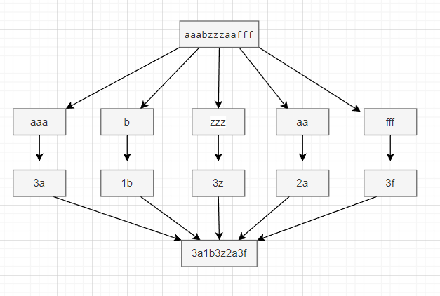
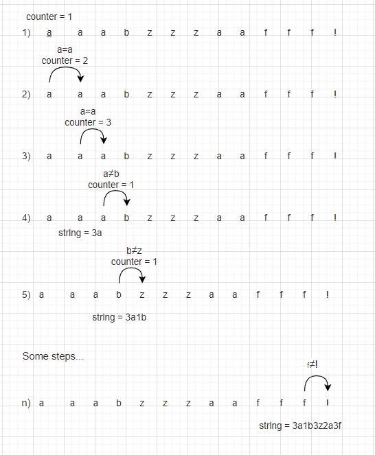

### Count Repeat Letters in String

**Task**: Given a string, entirely consisting of lowercase letters [**a-z**], collapse runs of these characters into the number of
repeats.<br>

**The idea of the algorithm**: To solve this problem, we need to perceive identical letters standing in a row as one word and calculate its length. To do this, we create a pointer to the element and go along the line, comparing with the next element. <br>

Task illustration:


<br>

### Solution algorithm

#### **First step**

We need check, that _inputString_ not empty. If empty, we throw an exception

```
if (inputString.length() == 0) {
            throw new RuntimeException("Empty string");
}
```

#### **Second step**

Add a stop symbol to the end of _input String_. In our case, the exclamation mark (!).<br>
Compare the **pointer** with the next element, if it is equal, increase the counter. Otherwise, we add
the counter and the current letter to _output String_, then reset the counter to "1".<br>
We do not go to the end of the string length, we stop "_length-1_" so that the "**element after the pointer**" does not go beyond the length of the string

```
inputString += SYMBOL_FOR_END_STRING;

StringBuilder outputString = new StringBuilder();

for (int i = 0; i < inputString.length() - 1; i++) {
    
    char current = inputString.charAt(i);
    
    if(current == inputString.charAt(i + 1)) {
        counter++;
    } else {
        outputString.append(counter).append(current);
        counter = 1;
    }
}
```

#### Third step

In order for us to accept only letters as input, we set limits.<br>
To do this, we compare the ASCII code of the element with the ASCII code for lowercase letters.<br>

_Important: We only need to compare the **pointer** code. The very last element of the string is not taken into account, since we are working up to the **length - 1** step._

```
char current = inputString.charAt(i);

if ((int) current < ASCII_A_LOWERCASE || (int) current > ASCII_Z_LOWERCASE) {
                throw new RuntimeException("Not letter");
}
```

<br>

Code illustration:




```
public class CountLetter {

    // ASCII code lower boundary
    private static final int ASCII_A_LOWERCASE = 97;
    
    // ASCII code upper boundary
    private static final int ASCII_Z_LOWERCASE = 122;
    
    private static final String SYMBOL_FOR_END_STRING = "!";

    /*
    * Return string with count repeat and letter
    */
    public static String repeatLetterCountInString(String inputString) {
        if (inputString.length() == 0) {
            throw new RuntimeException("Empty string");
        }
        
        int counter = 1;
        StringBuilder outputString = new StringBuilder();
        
        // Add symbol to string for stopping
        inputString += SYMBOL_FOR_END_STRING;
        
        /*
        * Comparing element with next element
        */
        for (int i = 0; i < inputString.length() - 1; i++) {
        
            // Pointer
            char current = inputString.charAt(i);
            
            // Setting lowercase letter boundaries
            if ((int) current < ASCII_A_LOWERCASE || (int) current > ASCII_Z_LOWERCASE) {
                throw new RuntimeException("Not letter");
            }
            if (current == inputString.charAt(i + 1)) {
                counter++;
            } else {
                outputString.append(counter).append(current);
                counter = 1;
            }
        }
        return outputString.toString();
    }
    
    // Run program
    public static void main(String[] args) {
        // Output: 3a1b3z2a3f
        System.out.println(repeatLetterCountInString("aaabzzzaafff"));
    }
}
```
